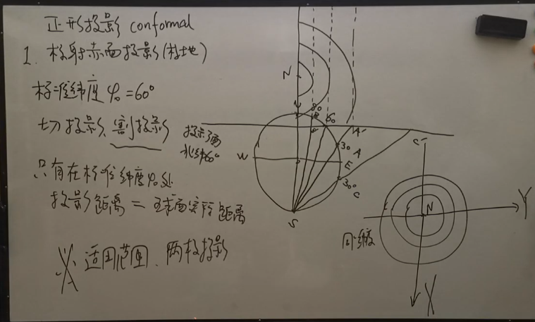
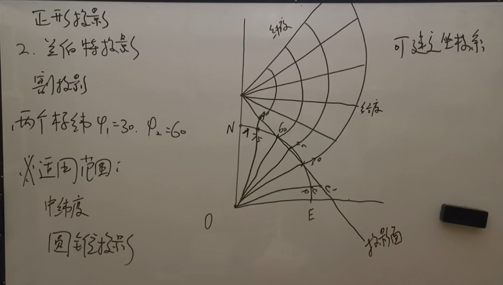
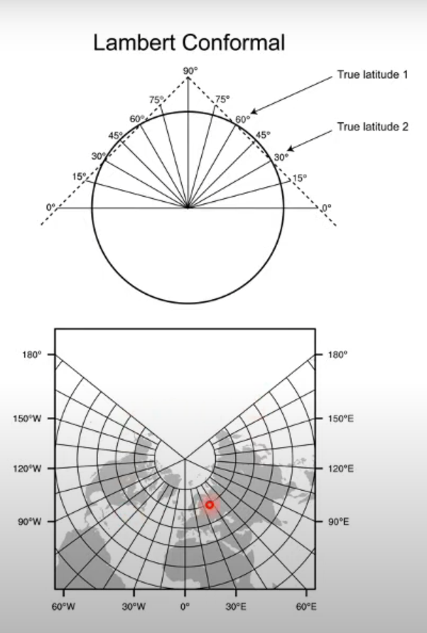
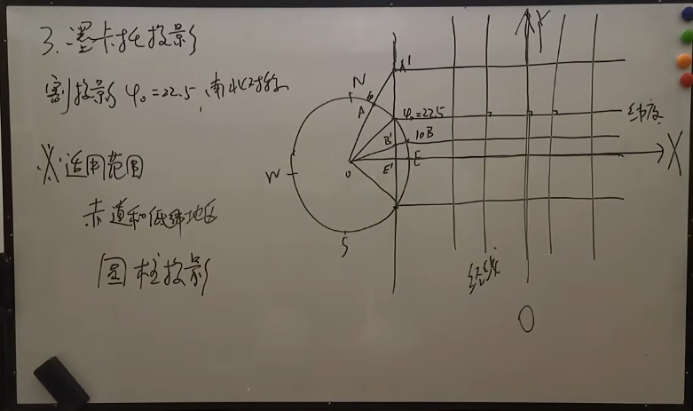

以下笔记来源于b站Up主[陈志强同学](https://space.bilibili.com/508321627)的视频
# 定义和分类
**投影**：以一定的数学几何关系，将椭圆形的地球信息表达于二维平面上

**分类**
1. 等角投影(正形投影, conformal): 即投影之后角度未发生变化, 这样能保证如风要素的一致性, 因此常用于模式中, 其他的非等角投影均不适用于模式.
   1. 极地投影(极射赤面投影)
   2. 兰伯特投影
   3. 墨卡托投影
2. 等面积
3. 等距离
4. 等形状
# 极地投影

当投影面在北极时, 光源则在南极点上(图中S处)

**标准纬度**(也就是投影平面所在的纬度)通常是60°, 极地投影**只有一个**标准纬度.

当标准纬度为90°时, 此时的投影被称作**切投影**, 否则被称作**割投影**

投影面展开的结果是一个同心圆

**适用范围**: 极地
# 兰伯特投影

通常有两个标准纬度(割投影), 也可以只有一个标准纬度(切投影).

光源点在球心处

投影面实际上是一个一个圆锥, 沿着某条经线展开成二维平面, **注意**, 这会导致一个缺口出现.

**适用范围**: 中纬度
# 墨卡托投影(圆柱投影)

割投影, 一个标准纬度(南北半球为相反数, 通常是一个较低的纬度) 南北对称, 光源位于球心

投影面展开是一个圆柱面
**适用范围**: 赤道附近